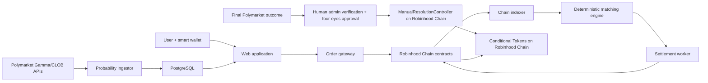
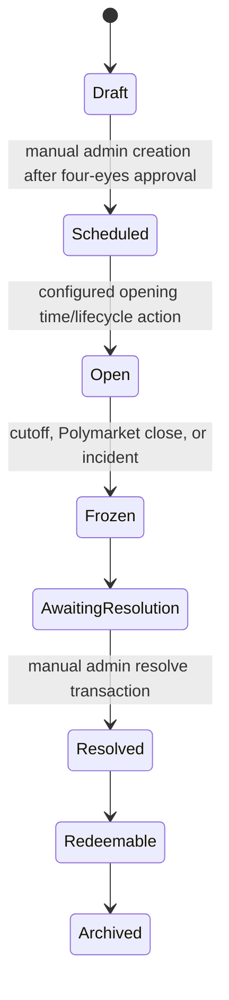

# Conditional Stocks on Robinhood Chain

## End-to-end product and implementation specification

**Status:** v1 architecture decision and implementation handoff

**Last updated:** 2026-09-04

**Intended readers:** product, smart-contract, backend, frontend, data, security, legal/compliance, and future coding agents

---

## 1. Executive summary

This product creates event-conditional markets for Robinhood Chain Stock Tokens. It answers a different question from a prediction market:

- Polymarket answers: “What is the probability that event E happens?”
- Our product answers: “At what price will participants agree today to exchange a Stock Token if E happens?”

For each stock/event pair, our venue runs exactly two independent central-limit-order-book markets:

1. **YES conditional stock book:** `STOCK_YES / USDG_YES`
2. **NO conditional stock book:** `STOCK_NO / USDG_NO`

For example, for the event “Will the United States allow Nvidia to sell specified advanced AI chips to China by the stated date?”, the platform may show:

- Polymarket probability: 30% YES
- Current NVDA Stock Token reference price: $220
- NVDA if YES: best executable conditional price around $260
- NVDA if NO: best executable conditional price around $203

Polymarket is the external source for the event, its displayed probability, and the reference outcome used by the operations team when resolving the corresponding local market. We do **not** operate a second prediction-market order book. Polymarket prices never move user funds and are never trusted as settlement values. In v1, an authorized admin manually verifies the final resolution of the exact mapped Polymarket condition and submits the matching local payout vector on Robinhood Chain. There is no automated cross-chain messaging, state proof, watcher/signer network, or automatic settlement integration in v1.

The conditional books use a conventional continuous CLOB with price-time priority. The matcher is offchain for speed; collateral reservation, fills, conditional-token creation, transfers, cancellation, and redemption are enforced on Robinhood Chain. Positions are fully collateralized. There is no leverage, unsecured shorting, liquidation engine, AMM, RFQ system, or periodic auction in v1.

The simplest viable production path is a curated, closed, capped pilot:

- one quote currency: USDG;
- a small approved set of liquid Stock Tokens;
- binary Polymarket events only;
- one deterministic matching operator;
- GTC limit orders and protected IOC orders;
- zero trading fees initially;
- embedded smart wallets and sponsored gas;
- no KYC/KYB, sanctions, geography, or appropriateness gating in v1; reconsider these controls only after legal consultation for a later version;
- admin-only manual market creation and admin-only manual resolution, with four-eyes review, multisig authorization, and a public evidence record;
- audited, non-upgradeable contracts with pause controls that cannot block withdrawals or redemption.

This document is the source of truth for the v1 design. Sections marked “later” are intentionally out of scope unless a product owner explicitly reopens them.

---

## 2. Product definition

### 2.1 What the instrument is

A conditional-stock trade is an event-contingent exchange of a Robinhood Chain Stock Token for USDG at an agreed price.

If Alice buys one `NVDA_YES` at 260, her intended payoff is:

- if the event resolves YES, Alice pays 260 USDG and receives one NVDA Stock Token;
- if the event resolves NO, Alice keeps or recovers her 260 USDG and does not receive NVDA.

Bob, the seller, receives the complementary payoff:

- if YES, Bob gives up one NVDA and receives 260 USDG;
- if NO, Bob keeps or recovers his NVDA and does not receive USDG.

This is implemented using fully collateralized conditional claims, not a promise to transact later. At fill time, the required stock and cash collateral are already controlled by the contracts and are split into YES and NO claims.

The NO book is symmetric. Buying one `NVDA_NO` at 203 means the stock-for-cash exchange is effective only if the event resolves NO.

### 2.2 What the instrument is not

It is not:

- a share in Nvidia Corporation;
- a new Robinhood-issued Stock Token;
- a conventional cash-settled stock future;
- a prediction-market token;
- a claim on the numerical Polymarket probability;
- a guaranteed estimate of the stock’s future exchange price;
- an oracle-set price;
- a leveraged or margined product in v1.

`NVDA_YES` and `NVDA_NO` are ERC-1155 conditional claims collateralized by the existing NVDA Stock Token. Winning claims redeem into the underlying Stock Token. `USDG_YES` and `USDG_NO` are ERC-1155 claims collateralized by USDG. Winning claims redeem into USDG.

### 2.3 The core economic identity

For a binary event with market-implied probability `q`, an approximate consistency relationship is:

```text
current_stock_value ≈ q × yes_conditional_value + (1 - q) × no_conditional_value
```

Example:

```text
$220 ≈ 0.30 × $260 + 0.70 × $203
```

This is a dashboard diagnostic, not a contract invariant. It can fail because of spreads, timing, financing, liquidity, different trader populations, Stock Token basis, risk premia, market hours, stale data, or event-definition mismatch. The protocol must never force the two conditional books to satisfy the equation.

### 2.4 The useful output

The headline research output is the pair of executable conditional-price ranges observed **before** the event becomes known:

- `stock if YES`;
- `stock if NO`;
- the spread between them, which is the market-implied event impact.

After resolution, the losing branch is worthless as a claim. Therefore, the useful counterfactual signal is the archived pre-resolution order-book snapshot or time-weighted measure—not the post-resolution token price.

### 2.5 Target users and their jobs to be done

The first trading users should be participants who already understand both event risk and onchain assets:

- **event-driven equity funds and proprietary traders** seeking a direct way to trade a stock’s event-specific impact;
- **existing Stock Token holders** who want to conditionally sell or hedge inventory only if an event occurs;
- **crypto-native macro/equity traders** who can arbitrage Polymarket probability, the ordinary Stock Token, and the two conditional books;
- **liquidity providers** quoting both branches and hedging with Stock Tokens, USDG, listed equity markets, and Polymarket where legally available;
- **analysts, research desks, journalists, and risk teams** who may consume the conditional-price signal without trading.

The initial outreach may focus on professional, sophisticated, or otherwise experienced users, but this is a product-positioning choice rather than an identity or jurisdiction access gate in v1. The product needs participants with different views of event impact, not merely different views of event probability. High-information, scheduled events—regulatory decisions, drug approvals, court rulings, elections, tariffs, and discrete policy announcements—are the strongest candidates.

Different participants supply different sides naturally. A Stock Token holder may post a conditional ask to sell only if a harmful or beneficial event occurs. An event-driven buyer may bid for that stock exposure. Arbitrageurs connect YES, NO, Polymarket, and the ordinary Stock Token. Dedicated liquidity firms are still highly desirable during launch, as explained in section 6.5.

---

## 3. Decisions that are fixed for v1

Future agents should not reopen these decisions without an explicit product decision:

1. Use **two continuous CLOBs**, YES and NO, for every listed stock/event pair.
2. Source the event probability from Polymarket; do not create a local probability market.
3. Manually create each local market through the admin workflow and map it to one exact binary Polymarket condition on Polygon. No API or background job may automatically list or create a market.
4. Resolve each local market manually through an admin-only onchain function after an authorized operator verifies Polymarket’s final resolution. Never settle automatically from an API response, displayed probability, cross-chain message, or watcher process.
5. Use in-kind settlement into Stock Tokens and USDG, not cash settlement against a stock-price oracle.
6. Fully collateralize all positions. No margin, borrowing, liquidation, or naked shorting.
7. Use an offchain deterministic matcher and onchain collateral/fill enforcement.
8. Use price-time priority and the resting order’s price.
9. Curate markets. Market creation and approval are manual admin-only functions; there is no permissionless or automatic market creation in v1.
10. Use USDG as the only quote asset.
11. Start with zero protocol trading fees.
12. Deploy non-upgradeable v1 contracts. Fixes ship as new versions; old positions remain redeemable.
13. Keep AMMs, batch auctions, RFQs, cross-margin, portfolio netting, automated resolution relays, and all cross-chain messaging/proof systems out of the initial release.
14. Do not implement KYC/KYB, sanctions screening, geography restrictions, appropriateness checks, investor-status checks, wallet allowlists, or compliance-provider integrations in v1. Revisit legal/compliance access controls only as an explicit later-version decision after counsel is consulted.

---

## 4. Platform dependencies and terminology

### 4.1 Robinhood Chain

Robinhood Chain is an EVM-compatible Arbitrum-based chain. Current official documentation identifies Robinhood Chain mainnet as chain ID 4663 and testnet as 46630, with ETH as the gas token. Deployment scripts must verify these values and all token/registry addresses against the current official documentation rather than relying on copied constants.

Use Robinhood’s term **Stock Tokens** in product and legal copy. A Stock Token is a Robinhood-issued tokenized debt security intended to track an underlying stock or ETF; it is not legally the underlying corporate share. The distinction must be visible to users.

Robinhood Stock Tokens use a multiplier mechanism for corporate actions and distributions. Raw ERC-20 balances do not simply rebase when the multiplier changes. Every service handling displayed quantities, valuation, deposits, withdrawals, or accounting must understand the ERC-8056 multiplier semantics described by Robinhood. Conditional-token collateral accounting should remain in raw token units; the UI should separately apply the current multiplier where Robinhood’s specification requires it.

Relevant official references:

- [Robinhood Chain documentation](https://docs.robinhood.com/chain/)
- [Stock Tokens](https://docs.robinhood.com/chain/stock-tokens/)
- [Building with Stock Tokens](https://docs.robinhood.com/chain/building-with-stock-tokens/)
- [Oracles and price feeds](https://docs.robinhood.com/chain/oracles-and-price-feeds/)
- [Account abstraction](https://docs.robinhood.com/chain/account-abstraction/)
- [Transaction finality](https://docs.robinhood.com/chain/transaction-finality/)

### 4.2 Polymarket

Polymarket supplies three things:

1. event discovery and metadata;
2. a live external implied probability for display and analysis;
3. the authoritative final payout vector of the specifically mapped condition.

Polymarket’s current conditional-token contracts are on Polygon chain ID 137. The integration must store the exact Polymarket condition ID and YES/NO token mapping. Market titles alone are not identifiers.

Relevant official references:

- [Market-data overview](https://docs.polymarket.com/market-data/overview)
- [CLOB order-book endpoint](https://docs.polymarket.com/api-reference/market-data/get-order-book)
- [Market WebSocket](https://docs.polymarket.com/api-reference/wss/market)
- [Polymarket contract addresses](https://docs.polymarket.com/resources/contracts)
- [Resolution process](https://docs.polymarket.com/concepts/resolution)
- [Institutional data and licensing](https://institutional.polymarket.com/)

### 4.3 Conditional Tokens Framework

The implementation uses the audited Gnosis Conditional Tokens model. An ERC-20 collateral asset can be split into ERC-1155 outcome positions and complementary positions can later be merged. After the outcome oracle reports payouts, claims can be redeemed for collateral.

Reference: [Conditional Tokens developer guide](https://conditional-tokens.readthedocs.io/en/latest/developer-guide.html)

### 4.4 Feasibility verdict

The design is technically implementable on Robinhood Chain because the chain is EVM-compatible, Stock Tokens and USDG are ERC-20 assets, and the conditional claims/exchange can be deployed as ordinary Solidity contracts. No native Robinhood conditional-token primitive is required.

Three dependencies sit outside ordinary Solidity engineering:

1. the Stock Token must permit transfer into and out of the Conditional Tokens contract;
2. production use must be acceptable to Robinhood/the issuer and regulators, including treatment of distributions and claim transfers;
3. the admin resolution process must reliably verify and manually copy the final Polymarket outcome because the two systems are on different chains and v1 deliberately has no automated cross-chain settlement path.

Therefore, “possible to build” is a clear technical yes. Issuer compatibility and data rights remain external dependencies. Legal classification and any resulting identity, jurisdiction, or transfer controls are deliberately deferred from v1 implementation, as explained in section 21.

---

## 5. One event, four claims, two books

For an event `E` and Stock Token `NVDA`, the local Conditional Tokens contract creates four relevant ERC-1155 positions:

```text
NVDA_YES   collateral: NVDA Stock Token, outcome index YES
NVDA_NO    collateral: NVDA Stock Token, outcome index NO
USDG_YES   collateral: USDG,             outcome index YES
USDG_NO    collateral: USDG,             outcome index NO
```

The split identities are:

```text
1 raw unit of NVDA collateral
    -> 1 raw unit of NVDA_YES + 1 raw unit of NVDA_NO

1 raw unit of USDG collateral
    -> 1 raw unit of USDG_YES + 1 raw unit of USDG_NO
```

The two books are:

```text
YES book: NVDA_YES / USDG_YES
NO book:  NVDA_NO  / USDG_NO
```

A quoted price is conditional USDG per one raw Stock Token unit. At the application layer, values are normalized to human-readable decimals and the Stock Token multiplier is applied consistently for display.

### 5.1 Resolution payouts

If the event resolves YES, the local payout vector is `[1, 0]`:

```text
NVDA_YES -> NVDA       USDG_YES -> USDG
NVDA_NO  -> 0          USDG_NO  -> 0
```

If the event resolves NO, the payout vector is `[0, 1]`:

```text
NVDA_NO  -> NVDA       USDG_NO  -> USDG
NVDA_YES -> 0          USDG_YES -> 0
```

If Polymarket finally resolves an invalid/unknown binary condition to `[1, 1]` with denominator 2, the resolution admin manually submits that same vector through the controller. Each YES or NO claim redeems for half of its collateral amount. The UI must disclose this outcome before order confirmation.

Claims do not literally mutate into ERC-20 tokens. The holder calls `redeemPositions`, directly or through the UI’s auto-redeem action, and receives the underlying ERC-20 collateral.

---

## 6. How the two CLOBs work

### 6.1 Orders contained in each book

Every book contains only limit orders for its own branch.

For the YES book:

- a **bid** is an instruction to buy `NVDA_YES` for at most a specified amount of `USDG_YES` per unit;
- an **ask** is an instruction to sell `NVDA_YES` for at least a specified amount of `USDG_YES` per unit.

For the NO book:

- a **bid** buys `NVDA_NO` using `USDG_NO`;
- an **ask** sells `NVDA_NO` for `USDG_NO`.

The user does not have to acquire conditional claims manually before the first trade. An order may be funded with either:

1. **whole collateral:** ordinary USDG for a bid or the ordinary Stock Token for an ask; or
2. **active-branch claims:** `USDG_YES/NO` for a bid or `STOCK_YES/NO` for an ask.

Supporting both funding modes is essential. Whole-collateral funding makes opening a position simple. Claim funding lets a holder trade out of or close an existing position before resolution.

The UI can label these as “available cash/stock” and “conditional balance”; it should not expose unnecessary protocol terminology. If a user wants to fund one order partly from claims and partly from whole collateral, the order gateway creates two linked child orders at the same price, one for each funding source. Keeping each signed order single-source makes contract accounting much simpler.

### 6.2 Matching rules

Each book follows strict price-time priority:

- highest bid first;
- lowest ask first;
- among orders at the same price, earliest confirmed sequence first;
- an order crosses when `bidPrice >= askPrice`;
- the resting maker order sets the execution price;
- partial fills are allowed;
- fills continue until the incoming quantity is complete, its price limit is reached, or available liquidity is exhausted.

The canonical time sequence comes from the `OrderOpened` event emitted on Robinhood Chain, not from a client timestamp. The event includes a monotonic sequence per market/branch. This prevents the matching operator from secretly reordering accepted orders without producing a detectable audit inconsistency.

### 6.3 Correct matching example

Suppose the YES asks are:

```text
1 NVDA_YES @ 260
2 NVDA_YES @ 262
5 NVDA_YES @ 264
```

A new **buy limit at 255 does not match anything**, because the cheapest seller requires 260.

A new buy limit at 264 for four units fills as follows:

```text
1 @ 260
2 @ 262
1 @ 264
```

The total is 1,048 USDG and the volume-weighted average price is 262. The buyer’s 264 limit is a maximum, not the automatic execution price. Because the asks were resting, each ask’s price is used.

If instead a sell order crosses resting bids, each resting bid’s price is used. A sell limit at 255 can receive price improvement by filling a resting bid at 260.

### 6.4 Supported order types

Launch with:

- **GTC limit:** rests until filled, canceled, expired, or the market freezes;
- **IOC limit:** fills immediately up to its limit and cancels the remainder;
- **protected market order:** represented as an IOC limit with an explicit worst acceptable price and maximum quantity/notional.

Do not implement an unbounded market order. The user must always have slippage protection.

FOK, post-only, reduce-only, stop orders, and iceberg orders may be added later. They are not needed for the first release.

### 6.5 Liquidity and market makers

The protocol does not require a privileged market-maker role. Any participant can place a resting bid or ask, and natural users or arbitrageurs can supply liquidity.

However, a CLOB cannot eliminate the economic need for somebody to quote first. An empty book remains empty until a user or liquidity provider posts an order. Software cannot manufacture a genuine executable counterparty without supplying inventory or adopting an AMM/auction design, which v1 has explicitly rejected.

For a usable pilot, recruit at least two independent liquidity partners and offer transparent, time-limited incentives based on two-sided uptime, spread, and depth—not trading volume alone. The system should still function without a designated market maker; it will simply show “no reliable price” when liquidity is absent.

---

## 7. Exact fill accounting

### 7.1 General materialize-and-swap model

At settlement, the contract materializes the active branch asset from each order’s declared funding source:

- if funded with whole collateral, split only the filled amount and return the newly created inactive-branch claim to the funding user;
- if funded with an active claim, debit that claim directly;
- transfer the active stock claim to the buyer;
- transfer the active USDG claim to the seller.

This creates one unified book. Whole-collateral and claim-funded orders can match each other without separate liquidity pools.

### 7.2 YES fill funded by whole collateral on both sides

For one unit at price `K`:

```text
Buyer supplies K USDG
    K USDG -> K USDG_YES + K USDG_NO

Seller supplies 1 NVDA
    1 NVDA -> 1 NVDA_YES + 1 NVDA_NO

Active claims are exchanged:
    Buyer receives: 1 NVDA_YES
    Seller receives: K USDG_YES

Inactive claims return to their original funders:
    Buyer receives: K USDG_NO
    Seller receives: 1 NVDA_NO
```

If YES resolves, the buyer redeems one NVDA and the seller redeems `K` USDG. If NO resolves, the buyer redeems `K` USDG and the seller redeems one NVDA.

### 7.3 NO fill funded by whole collateral on both sides

For one unit at price `K`:

```text
Buyer supplies K USDG
    Buyer ultimately receives: 1 NVDA_NO + K USDG_YES

Seller supplies 1 NVDA
    Seller ultimately receives: K USDG_NO + 1 NVDA_YES
```

If NO resolves, the buyer receives the stock and the seller receives the cash. If YES resolves, both recover their original collateral.

### 7.4 Closing positions with claims

Assume Alice previously bought the YES branch and holds:

```text
1 NVDA_YES + 260 USDG_NO
```

Alice can sell her `NVDA_YES` on the same YES book for `USDG_YES`. Once she has both `USDG_YES` and `USDG_NO`, she can merge equal quantities into whole USDG before resolution. The counterparty can likewise combine `NVDA_YES` with `NVDA_NO` and merge into whole NVDA if it holds both.

The Portfolio screen should expose:

- sell active claim;
- buy the complementary claim;
- merge complete sets;
- redeem after resolution.

Auto-merge should run when the user has equal complementary balances and no reservation needs them.

### 7.5 Bid reservation and price improvement

A whole-USDG bid reserves:

```text
remaining_quantity × limit_price
```

If it fills below its limit, only `fill_quantity × execution_price` is split. Price improvement is unlocked immediately. After a partial fill, the contract retains exactly the amount needed for the remaining quantity at the order’s limit.

An ask reserves the remaining base quantity. A claim-funded bid or ask reserves the corresponding active-claim amount.

### 7.6 Rounding

For v1, require both registered Stock Tokens and USDG to use 18 raw decimals, but still read and validate `decimals()` at registration. Prices use fixed-point `priceX18`.

For base quantity `qRaw`, base decimals `dBase`, and `priceX18`:

```text
quoteRaw = floor(qRaw × priceX18 × 10^dQuote / (10^dBase × 10^18))
```

Contract code must use full-precision `mulDiv`. For bids, reservation rounds up so it can never be under-collateralized; execution transfers round down to the smallest quote unit, with a documented maximum dust bound. The UI must preview raw and formatted amounts using exactly the same library vectors as the contract tests.

Suggested market configuration—not hardcoded protocol constants—is:

- price tick: 0.01 USDG;
- base step: 0.000001 Stock Token;
- minimum notional: 10 USDG;
- maximum order and market notional set by pilot risk caps.

---

## 8. End-to-end system architecture



### 8.1 Frontend

Recommended stack:

- Next.js and TypeScript;
- viem/wagmi for chain interactions;
- an embedded ERC-4337-compatible smart wallet provider supported on Robinhood Chain;
- WebSocket order-book updates;
- ordinary account/session controls without identity, jurisdiction, or appropriateness gating in v1;
- gas sponsorship for deposits, order submission, cancellation, merge, and redemption during the pilot.

The product must work with an external wallet too, but the embedded smart wallet should be the default experience. Before selecting Privy, Dynamic, Alchemy, ZeroDev, or another provider, run a proof of concept on both Robinhood testnet and mainnet and verify chain support, paymaster behavior, EIP-712 signing, ERC-1155 handling, and batching.

### 8.2 Backend services

Use a TypeScript monorepo and keep the initial deployment operationally simple. Services may begin as separate processes in one repository and one cluster:

1. **API gateway** — authentication/session handling, market data, and account state; no KYC or jurisdiction decisioning in v1.
2. **Order gateway** — validates price/size/tick/expiry, EIP-712 signature, balance, allowance, and market state.
3. **Matcher** — deterministic single-threaded state machine per `(marketId, branch)`.
4. **Settlement worker** — submits fills, handles replacement/retry, and reconciles receipts.
5. **Robinhood Chain indexer** — consumes finalized contract events and builds canonical balances/order/fill views.
6. **Polymarket ingestor** — fetches metadata and streams probability/order-book data.
7. **Market-admin console** — manual four-eyes market creation, lifecycle controls, resolution evidence review, manual resolution submission, and incident actions.
8. **Monitoring and alerting** — SLOs, oracle/feed freshness, balance invariants, failed settlements, and abuse signals.

Recommended infrastructure:

- PostgreSQL for durable application, audit, and market-data records;
- Redis for live book state, ephemeral queues, locks, and WebSocket fan-out;
- an append-only object-store export of orders, fills, Polymarket ticks, market-creation approvals, and manual-resolution evidence;
- a Ponder-based or small custom EVM indexer, provided it can replay idempotently from genesis/deployment block;
- one active matcher lease per book, with a hot standby that replays from the chain event sequence.

Do not split this into many independently deployed microservices until scale requires it. Determinism, replayability, and auditability matter more than early horizontal complexity.

### 8.3 Data trust boundaries

```text
Polymarket API data       display/research only; cannot settle funds
Final Polymarket outcome reference fact manually verified by admins; not read by local contracts
Robinhood Chain events   canonical local orders, fills, balances, and payouts
PostgreSQL/Redis          projections and caches; never sole custody ledger
Matching engine          proposes valid fills; cannot violate signed limits
Guardian                 can pause/freeze; cannot seize collateral or rewrite payouts
Resolution admin          manually submits the local payout; a disclosed v1 trust assumption
```

---

## 9. Smart-contract architecture

### 9.1 Contract set

Deploy one coherent, non-upgradeable protocol suite:

1. **ConditionalTokens** — pinned Gnosis ERC-1155 conditional claims; one global deployment.
2. **ProtocolAuthority** — the delayed-default-admin registry for the four narrowly scoped operational roles.
3. **MarketRegistry** — curated market definitions, states, risk caps, one immutable USDG quote-token address, and immutable Polymarket mapping.
4. **ConditionalExchange** — signed-order escrow, reservation accounting, cancellation, nonce invalidation, sequence assignment, and fill validation.
5. **OrderValidator** — stateless EIP-712 hashing and EOA/ERC-1271 verification, permanently bound to the exchange address used as the EIP-712 verifying contract.
6. **ConditionalSettlement** — exchange-only atomic CTF splitting and claim delivery. It has no administrator, recovery function, arbitrary call, or user entry point.
7. **IOCRouter** — bounded atomic IOC execution across at most 32 already-open maker orders, followed by unconditional remainder release.
8. **PositionRouter** — optional noncustodial merge/redeem convenience functions; direct CTF merge and redemption remain available.
9. **OrderRecoveryRouter** — bounded, permissionless, best-effort batches for expired, nonce-invalidated, or closed-market order release.
10. **ManualResolutionController** — admin-gated local CTF oracle that records the reviewed evidence hash and reports a one-time final payout; it contains no cross-chain verification or automatic settlement logic.

There is no `FeeTreasury` deployment in v1 because the fee is exactly zero.

The exchange/settlement/validator/router separation is a deployment and security boundary, not a change to atomic trade semantics. It keeps each runtime below the EIP-170 bytecode limit, isolates signature code from asset delivery, and leaves settlement with no independently callable privilege. Every fill still updates reservations, materializes claims, transfers outputs, and returns price improvement in one transaction or reverts in full.

Avoid per-market exchange deployments, proxy upgrades, ERC-20 wrappers for every outcome, margin vaults, or a general-purpose derivatives framework.

The v1 exchange uses **per-order contract escrow**, not a general custodial account ledger. Whole collateral or active claims move from the user’s wallet into `ConditionalExchange` when an order opens. Filled outputs and price improvement go directly to the configured recipient wallet; canceled collateral returns directly to the maker. This keeps the canonical user position in the wallet and makes every escrow amount attributable to a specific order hash.

Do not assume any ERC-20 supports EIP-2612 permit. The smart wallet should batch `approve` plus `openOrder` when permit is unavailable. Claim-funded orders use ERC-1155 approval, normally `setApprovalForAll`, with a clear UI warning and revocation control.

### 9.1.1 Contract responsibilities and interfaces

The exact Solidity API may change during implementation, but responsibility boundaries should remain:

```text
ConditionalTokens
  prepareCondition(oracle, questionId, 2)
  splitPosition(collateral, parent=0, conditionId, [YES, NO], amount)
  mergePositions(collateral, parent=0, conditionId, [YES, NO], amount)
  reportPayouts(questionId, payoutNumerators)   called only by manual controller oracle
  redeemPositions(collateral, parent, conditionId, indexSets)

MarketRegistry
  createMarket(immutableTerms, riskConfig)
  openMarket(marketId)
  freezeMarket(marketId, reasonHash)
  markAwaitingResolution(marketId)
  markResolved(marketId)
  getMarket(marketId)

ConditionalExchange
  openOrder(order, signature)
  cancelOrder(orderHash)
  cancelUpTo(newMinimumNonce)
  matchOrders(buyOrder, sellOrder, fillQuantity)
  releaseExpiredOrder(orderHash)

IOCRouter
  executeIOC(takerOrder, takerSignature, makerOrders, fillQuantities)

PositionRouter
  mergeForUser(collateral, conditionId, amount, recipient)
  redeemForUser(collateral, conditionId, indexSets, amounts, recipient)

OrderRecoveryRouter
  releaseExpired(orderHashes)
  releaseInvalidated(orderHashes)
  releaseClosedMarkets(orderHashes)

ManualResolutionController
  registerCondition(localMarketId, polygonMapping, localQuestionId)
  resolveMarket(localMarketId, payoutNumerators, payoutDenominator, evidenceHash, sourceReference)
```

`ConditionalExchange` escrows CTF claims and authorizes its permanently configured `ConditionalSettlement` to pull only the assets implied by a validated fill. `ConditionalSettlement` calls the CTF for materialization and delivery. `PositionRouter` calls it for optional merge/redeem convenience. None implements a second proprietary payout ledger.

`MarketRegistry.createMarket` is callable only by the authorized market-admin workflow in v1. Polymarket metadata ingestion may prefill a draft for review, but it must never create or approve a local market automatically. Opening may follow the configured time/lifecycle policy after the market has been manually created and approved; it cannot alter the immutable terms.

### 9.2 Non-upgradeability

V1 contracts should be non-upgradeable. The registry stores a protocol version. If a bug or feature change requires v2, deploy new contracts and stop opening new v1 markets. Never make old redemption dependent on a frontend or upgrade administrator.

### 9.3 Market identity

Each local market ID should be a hash of immutable terms:

```text
marketId = keccak256(
  protocolVersion,
  robinhoodChainId,
  baseStockToken,
  quoteToken,
  polygonChainId,
  polymarketConditionId,
  polymarketYesIndex,
  polymarketNoIndex,
  tradingOpen,
  tradingCutoff,
  rulesHash
)
```

Store or emit:

- base Stock Token address and validated decimals;
- quote USDG address and validated decimals;
- local CTF condition ID and question ID;
- exact Polygon Polymarket condition ID;
- Polymarket YES and NO outcome token IDs/index sets;
- canonical market/event URL or slug for human review;
- complete rules snapshot URI and content hash;
- stated end date and trading cutoff;
- tick, step, minimum notional, and caps;
- manual-resolution-controller address and controller version;
- creation block and protocol version.

After the market opens, these values cannot be edited. If the mapping is wrong, freeze the market before fills and create a new market ID. Never silently repair terms.

### 9.4 Order schema

Use EIP-712 typed data with explicit domain separation by chain ID, exchange address, name, and version.

```solidity
enum Branch { YES, NO }
enum Side { BUY, SELL }
enum FundingKind { WHOLE_COLLATERAL, ACTIVE_CLAIM }
enum TimeInForce { GTC, IOC }

struct Order {
    address maker;
    address recipient;
    bytes32 marketId;
    Branch branch;
    Side side;
    FundingKind fundingKind;
    uint128 quantity;
    uint128 limitPriceX18;
    TimeInForce tif;
    uint64 expiry;
    uint64 nonce;
    bytes32 salt;
}
```

The contract derives all token addresses/position IDs from the registry. An order must not be allowed to substitute arbitrary tokens.

### 9.5 Order lifecycle onchain

For a GTC order:

1. User signs the EIP-712 order and permit/approval if needed.
2. Order gateway performs all offchain checks and simulates the call.
3. Relayer calls `openOrder(order, signature, fundingAuthorization)`.
4. Exchange verifies signature, nonce, expiry, market state, tick/step, cap, and funding.
5. Required collateral/claim amount is transferred into or reserved inside the exchange.
6. Exchange stores `orderHash -> remaining, reserved, status, sequence` and emits the full `OrderOpened` event.
7. Indexer applies the chain-confirmed event; matcher adds it to the book.
8. Settlement worker calls `matchOrders(buyOrder, sellOrder, fillQuantity)` for crossing orders.
9. Exchange independently verifies both signed orders, their statuses, branch/market equality, opposite sides, crossing prices, remaining quantities, cutoff, and price-time-derived maker price.
10. Exchange materializes active claims, swaps them, updates reservations and remaining quantities, and emits `OrderFilled`.

The maker price is derived onchain from stored sequence values; it is not freely supplied by the matcher.

For IOC, the settlement worker submits an atomic `IOCRouter.executeIOC` call containing the signed taker and ordered list of already-open makers. The router opens the taker through the exchange, fills the supplied makers at each maker’s stored price, and releases the remainder in the same transaction. Any uncaught maker failure reverts the complete IOC transaction; the matcher must simulate and omit stale makers before submission.

V1’s contract can prove that every individual fill is collateralized, within both limits, and priced at the resting maker’s limit. It cannot cheaply prove that the authorized matcher did not omit a better resting order from the batch. Strict best-price/time ordering is therefore an audited venue obligation in v1, enforced by the deterministic engine, immutable chain sequence, independent shadow matcher, and alerts. A later protocol version may commit an onchain book root or allow permissionless fills if stronger censorship/fairness enforcement is justified.

### 9.6 Cancellations and nonces

- Maker can cancel any open order at any time before fill.
- `cancelOrder(orderHash)` releases the remaining reserved funding asset.
- `cancelUpTo(nonce)` invalidates all older user orders for emergency recovery.
- Expired orders are permissionlessly cancelable, but funds return only to the maker’s exchange balance or wallet.
- Market freeze cancels/release-processes all open orders in bounded batches; users can also release their own order immediately.
- Every fill and cancellation is replay-protected.

### 9.7 Roles

Use OpenZeppelin-style access control with tightly scoped roles:

- `MARKET_ADMIN_ROLE`: manually create and approve a curated market through the admin workflow;
- `MATCHER_ROLE`: submit fill batches, but never withdraw user funds;
- `RESOLUTION_ADMIN_ROLE`: manually submit the reviewed final payout through the resolution controller; assign this to a dedicated multisig, not an individual hot wallet;
- `GUARDIAN_ROLE`: freeze a market or pause new trading during an incident;
- treasury/multisig: administrative ownership through a timelocked multisig.

The guardian must not be able to:

- transfer user assets;
- change immutable market terms;
- report an arbitrary outcome;
- block cancellation, withdrawal of unreserved assets, merging, or redemption;
- upgrade contract code.

The resolution-admin role is the sole v1 authority that can report a payout. It cannot change a finalized payout, remap a market, transfer user collateral, or bypass the requirement that the market is frozen and awaiting resolution. Because the controller does not verify Polygon state, correct manual operation of this role is an explicit centralized trust assumption for v1.

### 9.8 Required events

At minimum:

```solidity
MarketCreated(...)
MarketStateChanged(...)
OrderOpened(...)
OrderCancelled(...)
OrderFilled(...)
CollateralSplit(...)
PositionsMerged(...)
ResolutionFinalized(...)
PositionsRedeemed(...)
EmergencyPauseChanged(...)
```

`ResolutionFinalized` must include the market ID, payout vector and denominator, evidence hash, source reference, admin caller, and transaction timestamp so the complete manual action is publicly auditable.

Events must contain enough identifiers to rebuild all order and fill state from chain history without the operator database.

---

## 10. Polymarket market-data integration

Implementation note (2026-09-05): milestone 12 is implemented in `packages/market-data`,
`services/polymarket-ingestor`, and `apps/api`. It uses strict binary mapping, REST bootstrap and
reconciliation, market-WebSocket updates, explicit probability-quality states, append-only raw/tick
storage, content-addressed evidence, independent admin review, simulation-only Safe transaction
generation, and Ponder reconciliation. The ingestor contains no chain client or transaction path;
resolution-looking events create alerts only. See
`docs/architecture/polymarket-data-admin-evidence-v1.md`.

### 10.1 Event selection

V1 accepts only a single, unambiguous, binary Polymarket condition with a final YES/NO payout vector. Exclude:

- multi-outcome markets;
- grouped or negative-risk constructions requiring multiple linked conditions;
- subjective resolution language;
- events likely to be clarified after trading opens;
- events whose result becomes known gradually over a long window;
- events with weak connection to the selected stock;
- markets with inadequate Polymarket liquidity or unreliable data.

Market creation is a manual admin-only function in v1 and requires four-eyes review: one authorized operator prepares the mapping; a second authorized operator verifies the condition ID, outcome ordering, rules, dates, stock association, and referenced source. Only after both reviews may the admin multisig call `createMarket`. No Polymarket API response, ingestion service, scheduler, or public caller may automatically create a local market.

### 10.2 Metadata ingestion

Use Gamma or the current official market-discovery API to ingest:

- event and market identifiers;
- condition ID;
- outcome labels and token IDs;
- question/rules text;
- end time;
- active/closed state;
- URL/slug;
- resolution metadata.

Persist the raw response, fetch timestamp, and a canonicalized hash. The Market Admin UI should show the raw IDs and force the reviewer to confirm the YES/NO orientation.

Metadata ingestion is an administrative convenience only. It may populate a draft form, but the draft has no onchain effect until the manual admin approval and transaction are completed.

### 10.3 Probability ingestion

Use the Polymarket CLOB WebSocket for live book changes and REST for startup/reconciliation. Maintain an in-memory copy of the external YES book and periodically compare checksums or snapshots.

The displayed probability should be derived from the executable Polymarket book, not blindly from the last trade. At minimum show:

- best YES bid and ask;
- midpoint when both are valid;
- spread;
- depth at a configured standard notional;
- timestamp and stale indicator;
- source label “Polymarket implied probability.”

If the book is one-sided, stale, crossed, or below a minimum depth, show an explicit low-confidence or unavailable state. Do not fabricate a point estimate.

For historical charts, store raw book-derived ticks and compute a documented time-weighted midpoint. A typical ingestion table contains:

```text
polymarket_condition_id
observed_at
yes_best_bid
yes_best_ask
yes_mid
spread
depth_bid_standard_notional
depth_ask_standard_notional
source_sequence_or_hash
is_stale
raw_payload_hash
```

### 10.4 Data licensing

Public technical access does not automatically grant commercial redistribution rights. Before production, obtain written confirmation of terms for displaying, storing, deriving, and redistributing Polymarket data. Polymarket’s institutional page directs capital-markets users—including exchanges, fintechs, and data distributors—to consult Polymarket and ICE. Treat licensing as a launch gate, not a post-launch cleanup item.

### 10.5 Failure behavior

If Polymarket market-data APIs fail:

- local CLOB trading may continue if the local market is otherwise healthy;
- hide or mark the probability stale;
- do not infer resolution from API absence;
- alert after defined freshness thresholds;
- reconcile all missed updates after recovery.

If the mapped Polymarket market closes early or appears to enter resolution, the ingestor alerts
operations. An authorized market-admin or guardian must explicitly freeze local order entry and make
resting orders releasable according to the lifecycle rules below; the data service does not submit
that action automatically.

---

## 11. Manual admin resolution for v1

### 11.1 Settlement authority

The local legal and technical definition should say, in substance:

> This conditional market settles solely according to the final payout vector recorded for the specified Polymarket CTF condition ID on Polygon, mapped to the local YES and NO indexes shown in the market terms.

This avoids two systems independently interpreting the same English sentence. The rules snapshot is still displayed for user understanding and audit, but the specified condition’s final Polymarket resolution is controlling as a matter of product rules. In v1, Robinhood Chain contracts do not verify that result themselves; authorized admins verify it and manually enter the corresponding payout vector.

### 11.2 Do not settle automatically from the Polymarket API

Never trigger local resolution automatically because Gamma or a CLOB endpoint says `resolved`, because the price reaches 0 or 1, or because a news source reports the event. APIs can be stale, spoofed, misread, or temporarily inconsistent. An authorized admin must first confirm that the mapped Polymarket market has reached its final resolution under Polymarket’s process and complete the manual review described below.

### 11.3 V1 manual admin flow

Market resolution is a manual admin-only function in v1:

1. After local trading is frozen, one authorized operator checks that the exact mapped Polymarket condition has finally resolved and that any dispute process is complete.
2. The operator verifies the condition ID and YES/NO orientation against the immutable local market mapping, then prepares a resolution packet containing:

```text
localMarketId
polymarketConditionId
yesIndexSet
noIndexSet
payoutNumerators
payoutDenominator
official Polymarket resolution URL/status
Polygon contract address, transaction hash, and block reference when available
verification timestamp
supporting screenshots or exported evidence
evidenceHash
```

3. A second authorized operator independently repeats the verification and approves or rejects the packet. The preparer and reviewer must be different people.
4. After approval, the market-admin multisig manually calls `beginResolution` with the exact
   `ManualResolutionController.hashResolution` commitment. It binds the chain, controller, market,
   payout vector, denominator, packet hash, and source-reference URI bytes, and moves the frozen
   market to `AwaitingResolution`.
5. After the indexed transition is reconciled, the dedicated resolution-admin multisig manually
   calls `resolveMarket` on Robinhood Chain with the payout vector, denominator, same evidence hash,
   and source reference.
6. `ManualResolutionController` checks the admin role, market state, registered local condition,
   permitted binary vector, exact prepared commitment, and single-use finalization guard. It does **not** fetch or verify Polygon
   state.
7. The controller records `ResolutionFinalized` and reports the payout vector to the local Conditional
   Tokens condition. Claims then become permissionlessly redeemable.

The admin multisig must use hardware-backed keys and a documented approval policy. Store the complete resolution packet and both human review records in append-only storage, and publish the evidence hash/source reference with the onchain event.

There are no automated Polygon watchers, signer-attestation nodes, oracle relays, bridges, state proofs, or cross-chain messages in v1. The contract therefore cannot prevent an authorized resolution admin from submitting a factually incorrect outcome. Role separation, multisig approval, four-eyes verification, immutable market mapping, public evidence, small pilot caps, and an incident process mitigate—but do not remove—this centralized trust assumption. The user terms and UI must disclose it clearly.

### 11.4 Later automation

Automated cross-chain resolution may be evaluated only after v1. If later adopted, it must use a mature messaging or state-proof mechanism that can verify the Polygon outcome on Robinhood Chain. It is a new adapter/protocol version, requires an explicit product decision and independent audit, and is not part of the v1 backlog.

### 11.5 Resolution edge cases

- **Polymarket dispute:** remain frozen and wait; no local deadline shortcut.
- **Invalid/unknown 50/50:** the admin manually submits `[1,1]/2` only after Polymarket’s final resolution is confirmed.
- **Polygon reorganization or inconsistent sources:** do not resolve; wait until the official final state is stable and both admins agree on the evidence.
- **Admin reviewer disagreement:** do not submit a resolution transaction; escalate and investigate.
- **Polymarket contract migration:** only the immutable configured contract/condition controls that market unless no fills ever occurred. With fills, do not remap.
- **Polymarket never resolves:** collateral remains in claims. The terms must disclose this dependency. A fallback outcome cannot be invented after launch.
- **Wrong market mapping discovered after fills:** freeze immediately, do not resolve under a substituted mapping, publish incident details, and follow legal/remediation procedures. Contracts must not let an admin rewrite the condition.

---

## 12. Market lifecycle



### 12.1 Draft and scheduled

- Verify Stock Token support, decimals, multiplier behavior, issuer status, oracle health, and deposits.
- Verify Polymarket mapping and rules.
- Set opening, cutoff, risk caps, tick, step, and standard display notional.
- Generate and sign a human-readable market-terms artifact whose hash is registered onchain.
- Complete the two-person admin review and manually submit the market-creation transaction; no ingestion service or scheduler may create the market.
- Do not accept deposits dedicated to the market until it is scheduled.

### 12.2 Open

- Accept orders from users whose wallets pass the protocol’s ordinary balance, allowance, signature, and market-state checks; there is no KYC eligibility check in v1.
- Display local books and Polymarket probability separately.
- Continuously monitor Stock Token oracle/multiplier status, Polymarket activity, chain sequencer, settlement queue, and caps.

### 12.3 Freeze

Freeze automatically at the earliest of:

- configured `tradingCutoff`;
- Polymarket closes or enters resolution;
- the outcome becomes publicly knowable before the scheduled time;
- Stock Token/oracle pause, corporate-action anomaly, chain incident, or guardian action.

On freeze:

- reject new orders and fills;
- cancel or make permissionlessly releasable all unfilled reservations;
- preserve already filled claims;
- calculate and archive the pre-resolution signal;
- keep withdrawals, merges, and eventual redemptions available.

The default cutoff should precede the expected announcement or Polymarket close by a configurable buffer, initially five minutes for precisely scheduled events and longer for events with uncertain timing. Market operations must be able to freeze earlier.

### 12.4 Pre-resolution signal snapshot

At freeze, archive:

- best bid/ask for both conditional books;
- executable buy and sell VWAP at the configured standard quantity;
- 30-minute time-weighted midpoint, if adequate observations exist;
- spread and depth;
- Polymarket probability, spread, depth, and timestamp;
- current Stock Token reference value and multiplier metadata;
- quality flags and all calculation parameters.

If either book fails the minimum two-sided depth/uptime requirement, label that conditional estimate unreliable. Do not fill missing values using the stock/probability identity.

---

## 13. User experience and flows

### 13.1 Onboarding

1. User creates an account or starts a wallet-based session.
2. Platform creates or connects a smart wallet.
3. User accepts the product’s technical and risk disclosures.
4. User deposits/bridges supported USDG or Stock Tokens.
5. Application waits for the configured Robinhood Chain confirmation policy and credits the portfolio.

V1 does not collect KYC/KYB information or perform sanctions, geography, investor-status, tax-status, or product-appropriateness checks. These controls may be designed for a later version after legal consultation.

The implemented Milestone 13 route map, data-trust boundaries, wallet transaction flow, admin workflow, and UX research record are documented in [`docs/architecture/web-admin-ux-v1.md`](./docs/architecture/web-admin-ux-v1.md).

### 13.2 Discover market

The market page should clearly separate three panels:

1. **Event probability** — sourced from Polymarket, with bid/ask/spread/time.
2. **Stock if YES** — our YES book, executable levels, depth, and chart.
3. **Stock if NO** — our NO book, executable levels, depth, and chart.

Also show:

- ordinary Stock Token reference price;
- event-impact spread;
- consistency residual;
- exact market rules and controlling Polymarket condition;
- cutoff and estimated resolution process;
- collateral and payout examples;
- liquidity/reliability warnings.

### 13.3 Place a buy

1. User selects YES or NO.
2. User selects Buy, quantity, and limit price—or a protected market order with maximum slippage.
3. UI previews worst-case reserved USDG, expected fills, fees (zero in v1), gas sponsorship, and both resolution outcomes.
4. UI chooses active USDG claims first if the user is closing/rotating a position; otherwise it uses whole USDG. Mixed funding becomes two linked child orders.
5. User signs EIP-712 order and funding authorization.
6. Order becomes live only after `OrderOpened` is confirmed and indexed.
7. Fills stream to the UI. Price improvement is released automatically.
8. Portfolio shows active stock claim plus any inactive cash claim created from whole collateral.

### 13.4 Place a sell

The flow is symmetric. The seller must own and reserve either the whole Stock Token or the active stock claim. There is no naked shorting. If the user lacks inventory, the UI must not offer the order.

### 13.5 Cancel

1. User clicks cancel.
2. Relayer submits cancellation.
3. UI shows pending until the chain event is indexed.
4. Remaining reserved collateral becomes withdrawable immediately after confirmation.

The UI must never claim an order is canceled solely because it was removed from Redis.

### 13.6 Close before resolution

The Portfolio screen calculates available close/merge paths:

- sell an active stock claim for active USDG on the same branch;
- buy a complementary stock claim, then merge stock positions;
- buy a complementary USDG claim, then merge cash positions;
- keep the position through resolution.

Show executable proceeds, not a theoretical mark, and warn when the book lacks depth.

### 13.7 Redeem after resolution

1. After the admin’s manual resolution transaction emits `ResolutionFinalized`, the application computes claim payouts.
2. User selects “Redeem all,” or wallet automation calls a batch helper.
3. Winning claims redeem into Stock Tokens/USDG; invalid outcomes redeem pro rata.
4. Losing claims are marked zero-value but remain historical records.
5. User may withdraw or use the collateral in another market.

Redemption must remain permissionless at the underlying Conditional Tokens contract even if the application is unavailable.

---

## 14. Product screens

Minimum launch screens:

1. **Home/discovery:** active events, PM probability, YES/NO conditional ranges, liquidity status, cutoff.
2. **Market detail:** event rules, three data panels, two order-book ladders, recent fills, order ticket, payoff preview.
3. **Portfolio:** whole assets, branch claims, reserved assets, open orders, event exposure, merge/redeem actions.
4. **Orders and fills:** canonical statuses, transaction links, child-order grouping, cancellation.
5. **Deposit/withdraw:** supported assets, network validation, confirmation progress.
6. **Resolution center:** final Polymarket outcome reference, manual admin resolution status, submitted payout, evidence hash/source links, admin transaction, and redemption status.
7. **Admin console:** manual market drafting/creation, mapping review, caps, lifecycle controls, two-person resolution review and submission, incidents, and reconciliation.

Avoid showing a single precise “NVDA if YES = $260” headline when the local book is illiquid. Prefer an executable range or standard-size VWAP with the size and timestamp attached.

---

## 15. Application APIs and events

Illustrative external endpoints:

```text
GET  /v1/markets
GET  /v1/markets/:marketId
GET  /v1/markets/:marketId/books/:branch
GET  /v1/markets/:marketId/trades
GET  /v1/markets/:marketId/probability
GET  /v1/markets/:marketId/resolution
GET  /v1/account/portfolio
GET  /v1/account/orders
POST /v1/orders/prepare
POST /v1/orders/submit
POST /v1/orders/:orderHash/cancel
POST /v1/positions/prepare-merge
POST /v1/positions/prepare-redeem
```

WebSocket topics:

```text
book.{marketId}.{YES|NO}
trades.{marketId}.{YES|NO}
probability.{marketId}
market_state.{marketId}
account.{wallet}.orders
account.{wallet}.fills
account.{wallet}.balances
resolution.{marketId}
```

The prepare endpoints return typed-data payloads and a complete preview. Submission endpoints accept signatures but never custody private keys.

Idempotency keys are required for order submission, cancellation, and relayed transactions. Every API response includes both application status and canonical chain status.

---

## 16. Data model

Core PostgreSQL tables or equivalent aggregates:

### 16.1 Accounts and wallets

```text
users
wallets
disclosure_acceptances
```

Store only the account, wallet, and disclosure state required for product operation. Do not collect or store KYC/KYB documents, sanctions results, jurisdiction decisions, investor classifications, or compliance-provider identifiers in v1.

### 16.2 Markets

```text
markets
market_terms_versions
polymarket_mappings
stock_token_metadata
market_state_transitions
market_risk_caps
```

### 16.3 Trading

```text
orders
order_reservations
fills
book_checkpoints
chain_transactions
account_balance_projections
claim_positions
merge_redemption_records
```

The chain is canonical. Database rows include source block number/hash, log index, confirmation state, and reorg status.

### 16.4 External data and resolution

Storage implementation update (2026-09-07): this original sketch is superseded by the
[database audit](audit/2026-09-07/database-optimization/REPORT.md). Unconsumed raw market-data history
and duplicate evidence mirrors are not written by the current implementation.

```text
polymarket_probability_ticks
polymarket_raw_snapshots
resolution_observations
resolution_evidence_packets
resolution_admin_reviews
resolution_admin_transactions
pre_resolution_snapshots
```

### 16.5 Audit and surveillance

```text
admin_actions
matcher_decisions
rejected_orders
market_abuse_alerts
system_incidents
```

Keep append-only raw records for the configured audit retention period. Clock synchronization is mandatory across services.

---

## 17. Matcher design

Implementation note (2026-09-04): milestone 09 is implemented in `packages/orderbook` and
`services/matcher`. The concrete data structures, replay/fencing protocol, research basis, and
verification commands are recorded in `docs/architecture/orderbook-matcher-v1.md`; independent
review and milestone 10/11 integration remain release gates.

### 17.1 Deterministic state machine

Partition by `(marketId, branch)` and process one ordered input stream per partition. The state can be rebuilt from:

1. confirmed `OrderOpened`, `OrderCancelled`, and `OrderFilled` chain events;
2. a verified book checkpoint;
3. pending settlement transactions reconciled against receipts.

Use integer raw quantities and `priceX18`, never floating point.

Suggested in-memory structures:

```text
bids: price-descending tree -> FIFO queue by chain sequence
asks: price-ascending tree  -> FIFO queue by chain sequence
ordersByHash: remaining/status/reservation metadata
```

### 17.2 Match loop

```text
while bestBid.price >= bestAsk.price:
    maker = order with earlier canonical sequence
    taker = the other order
    executionPrice = maker.limitPrice
    fillQty = min(bestBid.remaining, bestAsk.remaining)
    emit deterministic match proposal
    mark quantities pending settlement
    stop matching those quantities until transaction succeeds or is reverted/replayed
```

Batch multiple fills when gas and failure isolation permit. Cap batch size and gas. One invalid fill must not indefinitely block unrelated books.

### 17.3 Failure and replay handling

- Simulate every fill batch before submission.
- Assign a deterministic batch ID.
- Persist the proposal before broadcasting.
- Use explicit transaction nonce management and fee replacement.
- On revert, reload canonical order state and rematch.
- After a reorg, rewind projections to the common block and deterministically replay.
- Never publish a fill to the user as final until the configured chain confirmation state.

### 17.4 Fairness audit

For every fill, persist the pre-match best levels, canonical sequences, chosen maker, price, quantity, engine version, input event cursor, and output transaction. Run an independent shadow matcher and alert on differences. Publish aggregate fairness and uptime statistics.

The matcher can censor or delay orders in v1, but it cannot steal escrow, overfill, cross the wrong market, or violate signed limits. Censorship/fairness risk is disclosed and reduced with logs, monitoring, and eventually permissionless fill submission.

---

## 18. Stock Token price and corporate actions

The current Stock Token value is useful for the UI and sanity monitoring, but it is not needed to settle an in-kind conditional claim.

Use Robinhood’s supported Chainlink feeds according to the current integration guide. The implementation must:

- verify feed address from the official registry;
- check answer positivity and timestamp freshness;
- check sequencer-uptime/grace-period guidance;
- check Robinhood `oraclePaused()` or equivalent status;
- understand whether the returned value already includes the Stock Token multiplier;
- never mix raw REST stock prices with multiplier-adjusted onchain values without normalization.

Corporate actions create serious edge cases. For v1:

- do not list events whose trading/resolution window overlaps a known split, merger, spin-off, delisting, or extraordinary distribution;
- subscribe to Robinhood metadata/multiplier updates;
- freeze an affected market if a multiplier or token status changes unexpectedly;
- account and redeem in raw collateral units;
- display economic units using one versioned normalization function everywhere;
- test ordinary dividends, splits, reverse splits, and token pause behavior before production.

Legal/product terms must explain how any corporate action during a live market affects the Stock Token collateral and that the protocol mirrors the actual collateral token’s mechanics.

---

## 19. Risk controls

### 19.1 Market caps

Contract-enforced limits are maximum order quantity/notional, minimum notional, and aggregate
live open-order notional per wallet and per market. `maxMarketOpenNotional` means the market's
open-order notional cap. It decreases on fills and recovery; it does not bound filled exposure,
whole collateral locked in CTF, or total outstanding claims. Creation must admit two aligned
minimum orders at one base step simultaneously.

Daily venue volume, aggregate collateral exposure, and active markets per event/stock are operational
limits enforced or monitored outside these contracts. Standard permissionless CTF permits direct
splits, so a condition-wide issuance cap is not provided by this architecture. A pilot requiring a
hard contract-enforced exposure cap needs a separately reviewed architecture change before launch.

Wallet caps are address-based and Sybil-vulnerable. The market open-order cap applies across
addresses, but it is a book-utilization limit, not a loss or collateral-exposure limit. Raise limits
only after reconciled operating history and risk approval. See `docs/architecture/risk-caps.md`.

### 19.2 Automatic circuit breakers

Freeze new orders/fills on:

- Robinhood sequencer outage or finality anomaly;
- Stock Token or price oracle pause;
- Polymarket condition mismatch or unexpected closure;
- stale probability feed beyond the display SLO only if product policy requires it; otherwise mark stale without stopping local trading;
- reconciliation imbalance;
- matcher divergence;
- resolution-admin key compromise or conflicting manual verification;
- abnormal deposit/withdraw or market-abuse pattern;
- risk-cap breach.

Pause logic must be scoped. A probability-display outage alone should not trap positions.

### 19.3 No leverage

Every bid is backed by quote collateral/claims; every ask is backed by stock collateral/claims. Do not introduce:

- cross-margin;
- borrowing;
- external lending collateral;
- rehypothecation;
- negative balances;
- delayed collateral collection.

This removes liquidations and most counterparty credit risk at the cost of higher capital usage, which is the correct v1 tradeoff.

---

## 20. Contract invariants and security requirements

At minimum, formally specify and fuzz the following:

1. Total redeemable outcome claims can never exceed collateral controlled by Conditional Tokens for that collateral/condition.
2. Split creates equal raw quantities of complementary outcome claims.
3. Merge burns equal complementary quantities and returns exactly the permitted collateral amount, subject only to documented rounding.
4. A fill uses one registered market and one branch, one buy and one sell, and crossing prices.
5. Execution price equals the earlier-sequence resting order’s limit.
6. Filled quantity never exceeds either order’s remaining quantity.
7. Order hash, nonce, domain, signature, expiry, and status are valid exactly once.
8. Reserved assets cannot be withdrawn or reserved twice.
9. Cancellation releases only the remaining amount and cannot reverse a fill.
10. Market terms and local condition mapping are immutable after open.
11. Only the configured `ManualResolutionController`, called by `RESOLUTION_ADMIN_ROLE`, can report payouts.
12. Payouts are reported once, only while the market awaits resolution, and must contain a valid binary vector, denominator, evidence hash, and source reference.
13. Pause never prevents user cancellation, unreserved withdrawal, merge, or redemption.
14. No role can transfer user collateral to an administrator.
15. All token transfers handle false/no-return behavior safely.
16. Reentrancy cannot observe partially updated reservation/fill state.
17. ERC-1155 receiver hooks cannot reenter settlement.
18. Fee rate is exactly zero in v1 and cannot be changed for an open market.
19. A Stock Token multiplier change cannot alter raw collateral conservation.
20. Batch failure is atomic or precisely isolated as documented.

Security work:

- use audited CTF and OpenZeppelin components at pinned commits;
- minimize custom assembly;
- static analysis, unit tests, property tests, stateful fuzzing, differential accounting tests, and fork tests;
- at least two independent external audits, one focused on economic/accounting logic;
- manual-resolution error, compromised-admin, and adversarial-operations tabletop;
- capped public test phase and bug bounty;
- monitored multisigs and hardware-backed market-admin and resolution-admin keys;
- reproducible builds and verified source code;
- incident playbooks tested before deposits are enabled.

Never add a recovery function that can seize outcome collateral. Recovery may cover only unrelated tokens accidentally sent to a contract and must exclude every registered collateral and position ID.

---

## 21. V1 compliance scope and deferred legal review

This section records a product-scope decision, not legal advice or a conclusion that regulatory obligations do not apply.

V1 will not implement KYC/KYB, AML or sanctions screening, geography restrictions, investor-status checks, tax-status checks, product-appropriateness assessments, compliance-provider integrations, or identity-based wallet allowlists. The application and contracts will use ordinary wallet authentication, signature, balance, allowance, market-state, and risk-cap checks only.

The v1 Conditional Tokens layer will not add identity-based transfer restrictions to the standard ERC-1155 claims. Because the contracts are non-upgradeable, adding an allowlist-aware claim layer later would require a separately designed, audited, and deployed protocol version rather than a configuration change to live v1 markets.

The product owner will consult counsel separately and decide which of the following belong in a later version:

1. jurisdiction-by-jurisdiction product classification;
2. operating-entity, licensing, and permitted-user requirements;
3. Stock Token territorial restrictions and any required user-access controls;
4. KYC/KYB, AML, sanctions, geography, tax, investor-status, appropriateness, and ongoing screening;
5. transfer restrictions for conditional claims and the accepted identity/allowlist standard;
6. market-abuse, wash-trading, manipulation, spoofing, insider/MNPI, and employee-trading controls;
7. best-execution/fairness policy, complaints, error-trade policy, surveillance review, and regulatory reporting.

The following non-KYC dependencies remain relevant to the technical and operational design:

- confirm that Stock Tokens can be transferred into and out of Conditional Tokens contracts and determine how multipliers, distributions, pauses, and corporate actions behave;
- determine how collateral-held Stock Tokens are treated operationally;
- secure Polymarket/ICE and Robinhood data rights as applicable;
- disclose manual-admin resolution trust, delay or operator-error risk, indefinite resolution, invalid outcomes, smart-contract risk, chain/finality risk, illiquidity, and Stock Token basis.

Nothing in this document should be presented as a legal determination that a no-KYC deployment is permissible. It only fixes that KYC and related access-control engineering are outside v1 and may be added in a later version after legal consultation.

---

## 22. Fees and business model

Use zero protocol trading fees during testnet and the capped pilot. This keeps claim accounting exact and removes a distraction while measuring liquidity.

Possible later revenue:

- transparent maker/taker fee in USDG charged outside contingent collateral;
- market-data/API subscriptions;
- institutional analytics;
- listing/structuring services where legally permitted;
- sponsored event markets.

If trading fees are introduced, deploy a new exchange version or use a fee parameter that was immutably set when each market opened and capped in audited code. Collect the fee as additional whole USDG at fill time. Do not skim conditional collateral, because that breaks the intuitive “recover original asset if the other branch occurs” payoff.

Liquidity incentives should reward quoted depth, tight two-sided spreads, and uptime at useful sizes. Avoid pure volume mining, which invites wash trading.

---

## 23. Observability, reconciliation, and operations

### 23.1 Service-level indicators

Monitor:

- Robinhood Chain RPC latency, sequencer status, block lag, reorgs, and settlement finality;
- pending/reverted/replaced fill transactions;
- indexer head lag and projection checksum;
- matcher queue lag and shadow-matcher divergence;
- per-book spread, depth, two-sided uptime, and stale time;
- Polymarket WebSocket disconnects, snapshot divergence, and data age;
- unresolved markets awaiting manual review, resolution evidence completeness, admin-review status, and resolution-admin multisig/key health;
- onchain collateral versus total outstanding claims;
- reserved amount versus open order requirements;
- deposit/withdraw reconciliation;
- Stock Token multiplier/oracle status;

### 23.2 Reconciliation jobs

Run continuously and at daily close:

```text
contract ERC20 balances
    versus exchange available + reserved balances

CTF collateral locked
    versus total issued outstanding outcome claims

onchain order remaining/reserved
    versus database and live matcher state

onchain fills
    versus user statements and analytics

final Polymarket outcome and stored admin evidence
    versus the local manual-resolution transaction and payout vector
```

Any unexplained mismatch freezes affected new trading and pages an operator. Never auto-correct by editing balances in PostgreSQL.

### 23.3 Incident runbooks

Write and rehearse runbooks for:

- Robinhood Chain outage/reorg;
- matcher outage or double leader;
- compromised relayer;
- stale/corrupt Polymarket market data;
- disputed or delayed Polymarket resolution;
- resolution-admin key compromise, reviewer disagreement, or incorrect manual submission;
- wrong YES/NO mapping;
- Stock Token pause/corporate action;
- contract vulnerability;
- stablecoin issue;
- key rotation;
- frontend/API outage while direct redemption remains available.

Every incident action should produce an append-only record and, where relevant, an onchain reason hash.

---

## 24. Testing strategy

### 24.1 Smart-contract tests

- all order permutations: branch, side, funding kind, full/partial fill, maker orientation;
- price improvement and reservation release;
- whole/whole, whole/claim, claim/whole, and claim/claim fills;
- cancel/fill and fill/fill races;
- nonce invalidation, expired signatures, wrong domains, malleability;
- decimal and `mulDiv` boundaries;
- split, merge, YES, NO, and invalid payouts;
- role and pause constraints;
- malicious ERC-20/ERC-1155 callbacks;
- batch gas and denial-of-service limits;
- resolution-admin authorization, market-state gating, one-time finalization, missing evidence, and invalid/wrong payout vectors;
- immutable mapping and single finalization.

### 24.2 Matcher tests

- golden vectors for price-time priority;
- randomized order streams compared with a reference implementation;
- deterministic replay after crash;
- partial fill across multiple levels;
- cancellation/expiry during pending settlement;
- reorg rewind;
- property: no worse-than-limit fill;
- property: no later same-price order jumps the queue;
- property: book state equals canonical chain state after all receipts.

### 24.3 Integration and chaos tests

- Robinhood testnet with mock Stock Tokens, USDG, and admin-only manual resolution;
- manual resolution exercise using a real resolved Polymarket condition as the evidence source;
- Robinhood mainnet fork or archival simulation once supported;
- dropped WebSocket frames followed by REST recovery;
- RPC disagreement and reorg;
- unavailable or rejected resolution-admin multisig transaction;
- settlement worker restart mid-batch;
- paymaster failure with user-paid fallback;
- frozen market with thousands of open orders;
- frontend unavailable while contracts remain operable.

### 24.4 Economic simulations

Simulate sparse and adversarial books, event-probability jumps, stock-price gaps, PM/local latency, liquidity withdrawal, and corporate-action changes. Measure whether headline conditional prices meet minimum depth and spread standards; a technically working but empty CLOB is not a successful product.

---

## 25. Phased implementation plan

### Phase 0 — protocol and dependency validation

Deliverables:

- issuer/Robinhood approval for conditional wrapping;
- confirmation that v1 uses standard claims without identity-based transfer restrictions;
- Polymarket/ICE data license;
- verified Robinhood Chain RPC, token registry, USDG, Stock Token, Chainlink, wallet, paymaster, and explorer support;
- three example events approved end to end;
- written manual market-creation and admin-resolution policy, including two-person review and evidence requirements;
- record KYC, jurisdiction controls, appropriateness checks, and restricted claims as explicitly deferred post-v1 decisions pending legal consultation.

Exit criterion: no unresolved dependency that changes core token/custody architecture.

### Phase 1 — protocol prototype

Build:

- pinned Conditional Tokens deployment;
- MarketRegistry;
- ConditionalExchange with whole-funded GTC orders first;
- split-on-fill, two books, cancel, merge, redeem;
- admin-gated `ManualResolutionController` with mock evidence;
- Foundry test suite and invariants;
- simple admin CLI for manual market creation, manual resolution, and trading-test support.

Exit criterion: all economic paths reconcile under randomized stateful tests.

### Phase 2 — complete testnet product

Add:

- claim-funded orders and close/merge flows;
- IOC/protected market orders;
- TypeScript indexer, order gateway, matcher, settlement worker;
- Next.js user interface and embedded wallet;
- Polymarket metadata/probability ingestor;
- admin-only manual resolution workflow and evidence storage; no Polygon watcher, attestation service, bridge, or cross-chain messaging;
- admin console for manual market creation and manual resolution, plus caps, freeze lifecycle, and monitoring;
- replay/chaos tests.

Exit criterion: two-week internal test with no unexplained reconciliation difference and successful mock YES, NO, invalid, disputed, and delayed resolutions.

### Phase 3 — security and closed pilot readiness

- freeze interface and contract scope;
- two independent audits and fixes;
- economic review;
- key ceremonies and multisig/timelock deployment;
- runbook exercises;
- bug bounty;
- user disclosures and support processes;
- onboard at least two liquidity partners;
- publish verified contracts and resolution dashboard.

Exit criterion: security, issuer, data-license, and operations sign-off for the defined v1 scope. Legal/compliance access-control design remains deferred and is not a v1 engineering deliverable.

### Phase 4 — capped mainnet pilot

Suggested scope:

- 3 highly liquid supported Stock Tokens;
- 3–5 unambiguous scheduled binary events;
- a small initial participant cohort without KYC, geography, or appropriateness gating;
- small per-wallet and market-wide caps, with the documented limitation that wallet caps are not Sybil-resistant;
- zero fee and sponsored gas;
- 24/7 operational coverage around cutoffs/resolutions;
- public postmortem for any incident.

Exit criterion: at least three fully resolved market cycles with correct payouts, no custody discrepancy, acceptable two-sided liquidity, and approved review.

### Phase 5 — measured expansion

Only after pilot evidence, consider:

- more assets and events;
- any legally advised KYC, jurisdiction, appropriateness, or transfer-control system as a new protocol/application version;
- permissionless fillers;
- automated or stronger cross-chain verification as a separately approved post-v1 protocol version;
- additional order types;
- fee model;
- institutional API;
- portfolio netting or capital efficiency;
- AMM/RFQ/auction experiments as separate venues, not silent changes to the CLOB.

---

## 26. Product success metrics

Primary:

- percentage of open time with valid two-sided quotes on both branches;
- executable spread and depth at standard size;
- fill rate and time to fill;
- number and diversity of active liquidity providers;
- conditional-price reliability rate at freeze;
- repeat traders and retained collateral;
- manual resolution latency after Polymarket finality;
- zero incorrect or disputed local payouts;
- zero collateral reconciliation breaks.

Diagnostic:

- residual of `S0 - [q × S_yes + (1-q) × S_no]` using synchronized executable values;
- local/Polymarket timestamp skew;
- maker concentration;
- order rejection/revert rates;
- sponsored-gas cost per active trader;
- percentage of positions closed/merged before resolution;
- stale-feed and freeze events.

Do not use raw trade volume as the main success metric; it is easy to game and says little about the quality of the impact signal.

---

## 27. Explicit non-goals for v1

- running a prediction market;
- accepting Polymarket positions as local collateral;
- bridging Polymarket ERC-1155 tokens to Robinhood Chain;
- permissionless market creation;
- automatic or API-triggered market creation;
- KYC/KYB or identity-verification flows;
- sanctions, geography, investor-status, tax-status, or appropriateness gating;
- identity-based wallet allowlists or transfer-restricted conditional claims;
- multi-outcome events;
- overlapping or combinatorial conditions;
- margin, leverage, borrowing, or liquidations;
- naked short selling;
- cash settlement at an oracle stock price;
- AMM, batch auction, or RFQ matching;
- high-frequency co-location guarantees;
- cross-market portfolio margin/netting;
- mobile-native applications;
- governance token or DAO;
- protocol fees at launch;
- bespoke cross-chain light client;
- any cross-chain resolution messaging or proof verification;
- permissionless or automatic resolution;
- changing or overriding a payout after the admin resolution transaction is finalized.

---

## 28. Known hard problems and v1 readiness questions

The code is feasible on an EVM chain. The largest v1 engineering and operating risks are permission to wrap Stock Tokens in conditional claims, corporate-action handling, data licensing, liquidity, and the operational trust introduced by manual admin resolution—not whether two Solidity order books can be built. Legal classification and identity/jurisdiction access controls are tracked as deferred post-v1 questions in section 21.

Before declaring v1 technically and operationally ready, decision-makers need clear answers to:

1. Do Robinhood/issuer documentation and agreements support Stock Tokens being locked in CTF and represented by conditional ERC-1155 claims?
2. How are economic adjustments and distributions handled while the Stock Token is contract collateral?
3. Do we have the required rights to use and redistribute Polymarket probability data?
4. Is the admin-only manual resolution model, with its disclosed delay and operator-error risk, acceptable for the capped v1 pilot?
5. Can at least two independent liquidity providers quote useful two-sided depth?
6. Are Robinhood Chain wallet, paymaster, indexing, and finality dependencies ready for the target service level?

KYC, jurisdiction, investor eligibility, and identity-based transfer restrictions are not v1 readiness items because they are explicitly outside the v1 implementation scope. They must be reconsidered as part of the later legal consultation and protocol-version decision described in section 21.

---

## 29. Repository and delivery structure for implementation agents

Recommended monorepo:

```text
apps/
  web/                    Next.js product
  admin/                  market operations console
  api/                    public/private API
services/
  matcher/
  settlement-worker/
  rh-indexer/
  polymarket-ingestor/
packages/
  contracts/              Foundry project
  contract-bindings/      generated ABIs/types
  domain/                 shared integer math and schemas
  orderbook/              deterministic matching library
  market-data/            PM and Stock Token adapters
  ui/                     shared components
  config/                 chain/token/market versioned config
infra/
  environments/
  monitoring/
  runbooks/
docs/
  market-terms/
  architecture/
  adr/
```

Use one versioned domain package for order hashing, quantity normalization, price math, and payout previews across frontend/backend/tests. Golden test vectors must prove identical hashes and amounts in Solidity and TypeScript.

### Suggested build order for coding agents

Detailed scope, deliverables, tests, and exit criteria for each step live in [`plans/README.md`](plans/README.md).

1. Write ADRs from the fixed decisions in section 3.
2. Define Solidity interfaces, market/order schemas, and mathematical test vectors.
3. Implement Conditional Tokens integration and mock ERC-20 collateral.
4. Implement MarketRegistry and immutable mapping.
5. Implement reservation, cancel, and whole/whole YES fill.
6. Add NO fills and all funding combinations.
7. Add merge/redeem helpers and pause invariants.
8. Implement the admin-gated manual resolution controller and evidence/audit workflow.
9. Build deterministic matching library with golden vectors.
10. Build chain indexer and reconciliation before the trading UI.
11. Build gateway/settlement worker and end-to-end test harness.
12. Add Polymarket display data ingestion and the admin resolution-review interface; do not add automated resolution watchers.
13. Build market/portfolio/admin screens.
14. Add monitoring, runbooks, and audits; leave KYC and related compliance gating out of v1.

---

## 30. Agent handoff checklist

Every future agent should read this entire file before changing architecture. Before implementing a task, it should identify:

- which fixed v1 decision applies;
- whether it touches custody, payout, Stock Token normalization, market mapping, or would introduce identity/transfer gating contrary to the fixed v1 scope;
- the onchain source of truth and relevant invariant;
- how the change is replayed/reconciled;
- how YES, NO, and invalid outcomes behave;
- how whole-funded and claim-funded positions behave;
- whether cancellation, withdrawal, merge, and redemption remain available under pause;
- which test proves the change does not under-collateralize the system.

Any proposed change involving leverage, settlement authority, token transferability, proxy upgrades, arbitrary admin correction, new collateral, or a new event type requires an explicit architecture/security/legal review. It is not a routine implementation detail.

---

## 31. Final recommended launch design in one page

```text
Event/probability:
  Exact binary Polymarket condition on Polygon.
  Probability is external display data only.

Local market:
  YES CLOB: STOCK_YES / USDG_YES
  NO CLOB:  STOCK_NO  / USDG_NO
  Continuous price-time priority; resting order price.

Collateral:
  Fully funded Stock Token asks and USDG bids.
  Split only filled whole collateral into branch claims.
  Existing active claims can directly fund orders and enable exits.
  No leverage or liquidation.

Execution:
  EIP-712 orders; onchain reservation and canonical sequence.
  Offchain deterministic matcher; onchain limit/collateral/fill checks.
  GTC and protected IOC only at launch.

Resolution:
  Admin manually verifies the final mapped Polymarket resolution.
  A dedicated resolution-admin multisig manually submits YES, NO, or invalid payout.
  Four-eyes review and public evidence hash/source record; one-time finalization.
  No watchers, signer network, bridge, state proof, or cross-chain messaging in v1.

Technology:
  Non-upgradeable Solidity contracts; Next.js/TypeScript;
  PostgreSQL + Redis; chain indexer; embedded AA wallet; sponsored gas.

Launch:
  Curated and capped pilot with no KYC, geography, or appropriateness gating in v1.
  Market creation and resolution are manual admin-only functions.
  One quote token, a few stocks/events, zero fees, two liquidity partners.
  KYC and legal access-control design are deferred to a later version.
  Mainnet readiness still requires security, issuer compatibility, data rights, and operations approval.
```

This design preserves the essential insight: Polymarket prices the probability; the conditional CLOBs price the stock impact. It also makes every filled position fully collateralized, lets users exit through the same books, and prevents an external market-data API or matching server from unilaterally determining payouts or taking custody.
