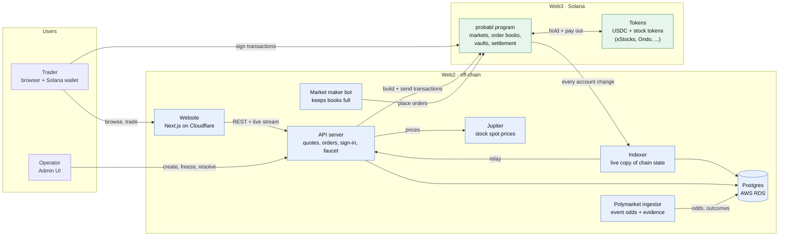
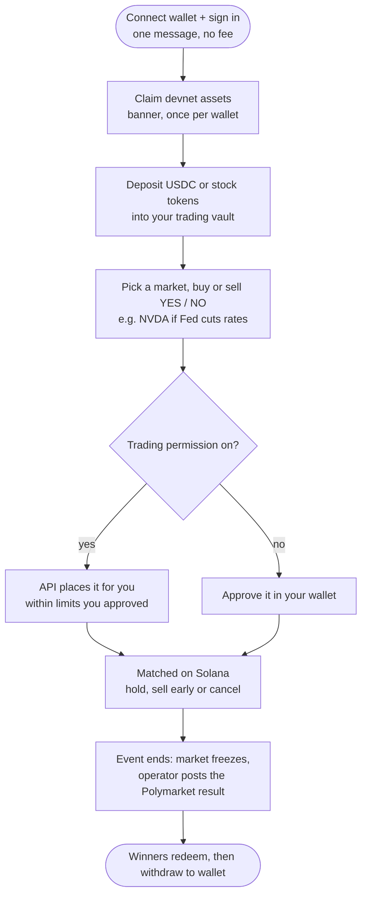

# probabl — Solana

Trading, custody, resolution and indexing run on Solana. The public and admin interfaces use the native API.

**Work in progress, not production-approved.** Full program coverage and an independent security review remain outstanding. See [SECURITY.md](SECURITY.md) for release gates.

A market is one order book per asset (for example "NVDA if YES") with one USDC quote
and up to three whitelisted issuer tokens of the same stock as base legs (for example
xStocks `NVDAx`, Ondo `NVDAon`, Remora `NVDAr`). Bids can accept several issuers;
asks deliver one. Claims stay segregated per issuer. See
[multi-issuer markets](docs/multi-issuer-markets.md).

Classic SPL and selected Token-2022 collateral are supported, including fee-bearing
tokens with net accounting and signed receipt limits, and regulated issuer controls
(permanent delegate, pause, default account state, UI multiplier, unset transfer hook,
confidential-transfer mint config) admitted explicitly per custody pool. This does
**not** mean every issuer or extension is supported. Read the [compatibility matrix and
issuer integration gates](docs/TOKEN_COMPATIBILITY.md) before listing any asset.

## How it works

### System design

Web2 (blue) runs the site, API and data. Web3 (green) holds the money and the rules.
Users always sign with their own wallet; the servers never hold user funds.



| Piece | Job in one line |
| --- | --- |
| **Program** | The rulebook on Solana. Holds deposits, matches orders, pays winners. |
| **Website** | What traders see. Reads from the API, sends signed transactions to Solana. |
| **API** | Prepares orders and transactions, signs users in, serves prices and data. |
| **Indexer** | Watches the program live (Yellowstone gRPC) so pages load fast. |
| **Postgres** | Stores history, events and evidence. Never holds money. |
| **Polymarket ingestor** | Pulls event odds and outcomes used to list and resolve markets. |
| **Market maker** | A bot that keeps buy and sell orders on every book. |
| **Admin UI** | Operators list markets, freeze them at the deadline and post the result. |

### User flow



In short: **connect → fund → deposit → trade YES/NO → event resolves → redeem → withdraw.**

## Local development

Prerequisites: Bun 1.3.14, Rust 1.97.1 (pinned), Anchor CLI 1.1.2, Agave/Solana CLI 3.1.10 and PostgreSQL tools (`initdb`, `pg_ctl`) on PATH.

```sh
bun install --frozen-lockfile
bun run build:contracts
```

The indexer and API stream chain state over Yellowstone gRPC (Geyser). Install
the plugin once (Linux downloads the checksum-pinned release; macOS builds the
pinned tag from source):

```sh
bun scripts/solana/yellowstone.ts   # writes .local/yellowstone/geyser-10000.json
```

In a separate terminal, start a local validator with an unused ledger directory:

```sh
solana-test-validator --ledger .local/validator \
  --bind-address 127.0.0.1 --rpc-port 8899 \
  --limit-ledger-size 1000000 \
  --geyser-plugin-config .local/yellowstone/geyser-10000.json \
  --bpf-program 53gtyz9nYzS7vwSbx2v7GeGLrMTas7vCATkjiKvAG1ra target/deploy/conditional_stocks.so
```

`YELLOWSTONE_GRPC_URL` (default `http://127.0.0.1:10000`) points the indexer at
the stream; on devnet/mainnet use a hosted endpoint and `YELLOWSTONE_X_TOKEN`.
The indexer is the only subscriber: the API reads its loopback relay
(`INDEXER_RELAY_URL`, default `http://127.0.0.1:42070`).

Then:

```sh
bun run solana:bootstrap
bun run solana:dev
```

Public UI: http://localhost:3001. Admin UI: http://localhost:3002. API: http://127.0.0.1:3000. Indexer: http://127.0.0.1:42069.

Bootstrap creates a mock quote token, mock issuer tokens replicating the mainnet xStocks/Ondo/Remora Token-2022 configurations, two multi-issuer markets, resting liquidity and local test wallets under ignored `.local/`. It never reads a default wallet or source-project credentials, and refuses to overwrite an existing deployment. All demo tokens are mocks, without real stock rights. Reuse the same validator ledger and generated environment on restart; a different genesis is a different deployment.

The dev runner prints its PostgreSQL URL and retains its owned database/log directory on shutdown. By default it starts a fresh isolated database each run; previous offchain evidence remains in the retained directory, not automatically restored. Set an explicit localhost `DATABASE_URL` to reuse a running persistent database instead; the runner verifies the deployment and does not stop that database on shutdown. Do not use this development runner for production.

For a browser wallet, select the matching localhost Solana RPC. The program requires actual SPL funding; a newly connected wallet has no demo stock or quote tokens. Generated test wallets are used by automated rehearsals and are not imported into your browser wallet.

Polymarket metadata/probability ingestion is optional in the mock demo. Set a new `POLYMARKET_INTERNAL_TOKEN` and `POLYMARKET_INGESTOR_URL=http://127.0.0.1:42073` to start the reference-data service. Real external market mappings and evidence must be reviewed before listing.

## Devnet staging

The [Devnet deployment runbook](docs/runbooks/solana-devnet.md) covers an env-file
deployer key, guarded/resumable program deployment, a mock USDC quote and mock issuer
tokens per asset (NVDA/TSLA/SPY, replicating real issuer Token-2022 configurations),
wrapped Devnet SOL, and configuration exports for the backend and local UI.
Start with `.env.devnet.example`; actual deployment requires the wallet key,
sufficient Devnet SOL and an explicit `devnet:deploy --execute` command.

## Verification

```sh
bun run typecheck
bun run test                     # fast TS + host Rust tests
bun run test:references          # Polymarket service; isolated PostgreSQL required
bun run test:solana              # SBF core, Token-2022 and multi-issuer suites; localhost validator required
bun run test:pools               # protocol-wide custody (SOLANA_POOL_TEST_RPC)
bun run test:delegation          # trading delegation (SOLANA_DELEGATION_TEST_RPC)
bun run test:coverage            # host-instrumented Rust report, NOT SBF coverage
bun run build:ui
bun run build:admin-ui
```

With a localhost validator and PostgreSQL running, set `TEST_DATABASE_URL` to an isolated local database server URL and run `bun run test:application`. It creates fresh mock wallets, protocol configuration, liquidity, a disposable database and API/indexer ports. It executes real signed trades and native administrative transactions without touching the UI demo's liquidity. Test services stop and the exact disposable database is removed afterward; generated mock fixtures remain under ignored `.local/app-test-*` for diagnosis.

`bun run start:api`, `start:indexer`, `start:polymarket`, `start:ui` and `start:admin-ui` run individual services. Supply the generated environment, a persistent PostgreSQL URL and matching deployment configuration. Reconciliation runs inside the indexer; `start:reconciler` probes its latest result.

## Active implementation

| Area | Location |
| --- | --- |
| Rust program | `programs/conditional-stocks` |
| Integer accounting and property tests | `crates/protocol-core` |
| Native SDK, planner, evidence, instruction validation | `packages/solana-client` |
| Native API and admin workflow | `apps/api/src/solana.ts`, `apps/api/src/solana/admin/routes.ts` |
| Finalized projections, durable replay, reconciliation | `services/solana-indexer` |
| Public/admin UI and design system | `apps/ui`, `apps/admin-ui` |
| Reused metadata/probability and relational storage | `packages/market-data`, `packages/db`, `services/polymarket-ingestor` |
| Local setup | `scripts/solana` |

The repository contains only the Solana implementation and its external Polymarket data integration.
